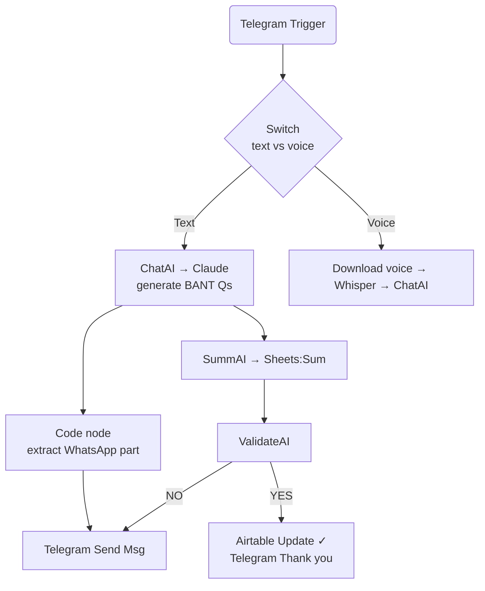

# QualifAI – AI‑assisted BANT Qualification Bot for n8n

QualifAI is a drop‑in **n8n** workflow that turns a Telegram bot into an AI‑powered sales assistant.
It guides prospects through a short chat or voice exchange, collects the **BANT** (Budget – Authority – Need – Timeline) signals, and writes clean, validated records to Google Sheets and Airtable – all without manual intervention.

---

## ✨ Features

* **Telegram intake (text or voice)** – Users can type or send voice notes; Whisper transcribes audio.
* **Multi‑turn AI conversation** with Anthropic Claude 3.5 Haiku and a sliding WindowMemory for context.
* **BANT‑aware question generation & validation** – The bot asks the minimum number of follow‑up questions and decides when a lead is *Qualified*.
* **Human‑readable summaries** stored in Google Sheets (`Sum` tab) and validation flags in a separate sheet (`Val` tab).
* **CRM sync** – Creates/updates Airtable records and flips a *Status* field to `Validated` for ready leads.
* **No coding required** – Import the JSON, add credentials, hit *Activate*.

---

## 🗺️ Workflow overview



*(Diagram simplified – see `QualifAI.json` for the exact flow.)*

---

## 🚦 Prerequisites

| Service                        | Purpose                     | n8n credential            |
| ------------------------------ | --------------------------- | ------------------------- |
| Telegram Bot API               | Chat endpoint               | **telegramApi**           |
| Anthropic API key              | Claude LLM                  | **anthropicApi**          |
| OpenAI API key                 | Whisper STT                 | **openAiApi**             |
| Google Cloud OAuth (Sheets)    | Reading & writing summaries | **googleSheetsOAuth2Api** |
| Airtable Personal Access Token | CRM table sync              | **airtableTokenApi**      |

> **n8n version:** 1.48 or newer (with `@n8n/n8n-nodes-langchain` ≥ 1.7).

---

## ⚙️ Quick start

1. **Clone** this repository and open n8n.
2. **Import** `QualifAI.json` (**Workflows → Import from File**).
   Or via CLI:

   ```bash
   n8n import:workflow --input QualifAI.json
   ```
3. **Create the credentials** listed above in *Credentials*.
4. **Update IDs**

   * Spreadsheet ID & sheet names in the Google Sheets nodes
   * Airtable *Base* & *Table* IDs in the Airtable nodes
   * (Optional) adjust prompts in **ChatAI**, **SummAI**, **ValidateAI**.
5. **Expose** n8n with an HTTPS URL, then set your Telegram bot webhook:

   ```bash
   curl "https://api.telegram.org/bot<YOUR_TOKEN>/setWebhook?url=https://<your-domain>/webhook/telegram"
   ```
6. **Activate** the workflow. Send `/start` to your bot to test.

---

## 🛠️ Customisation

| Need to change…               | Where                                    |
| ----------------------------- | ---------------------------------------- |
| Conversation language or tone | *systemMessage* in **ChatAI**            |
| Qualification logic           | Prompt in **ValidateAI**                 |
| Memory depth                  | `Window Buffer Memory` → *Memory window* |
| Output destinations           | Swap or extend Sheets/Airtable nodes     |

---

## 🧩 Environment variables (optional)

If you prefer env vars over n8n’s credential store, add the following before starting n8n:

```bash
export TELEGRAM_BOT_TOKEN="..."
export OPENAI_API_KEY="..."
export ANTHROPIC_API_KEY="..."
export AIRTABLE_PAT="..."
export GOOGLE_CLIENT_ID="..."
export GOOGLE_CLIENT_SECRET="..."
export GOOGLE_REFRESH_TOKEN="..."
```

Then reference them in the corresponding credentials.

---

## 📂 Repository layout

```
└─ QualifAI/
   ├─ QualifAI.json      # n8n workflow export
   └─ README.md          # this file
```

---

## 🤝 Contributing

Pull requests are welcome! Please open an issue first to discuss major changes.

---

## 📝 License

MIT © 2025 Francisco
